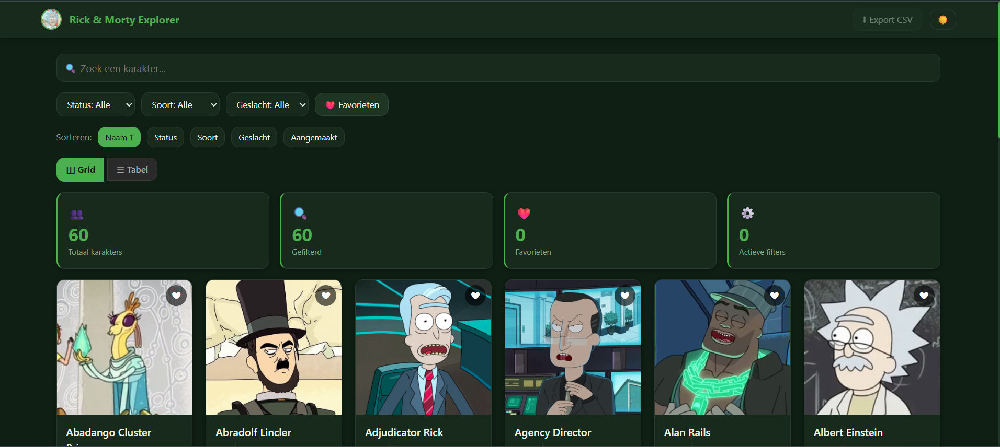
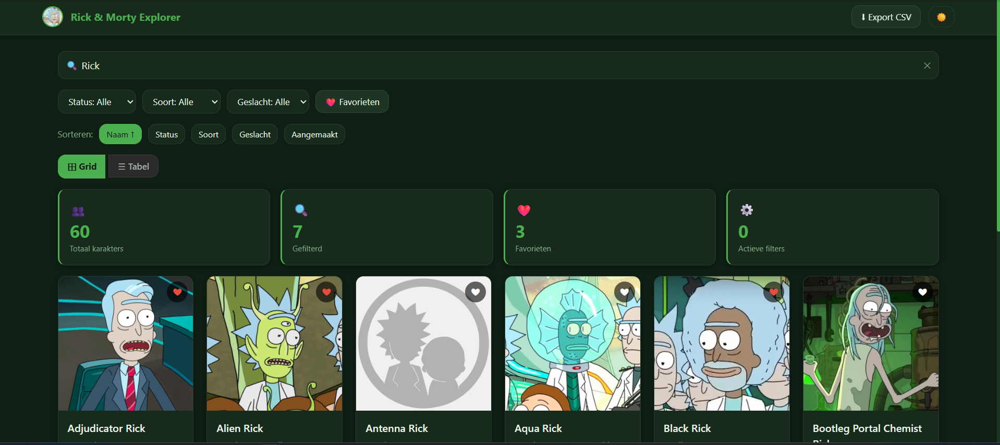
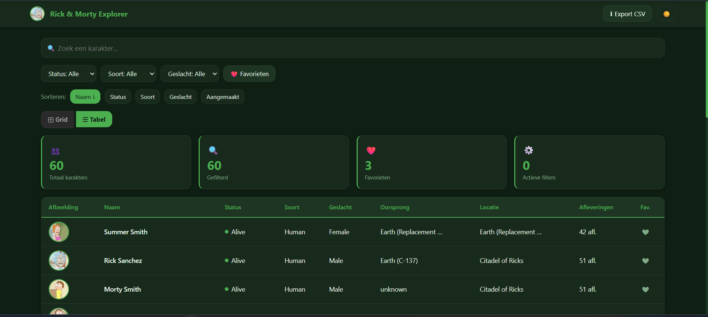
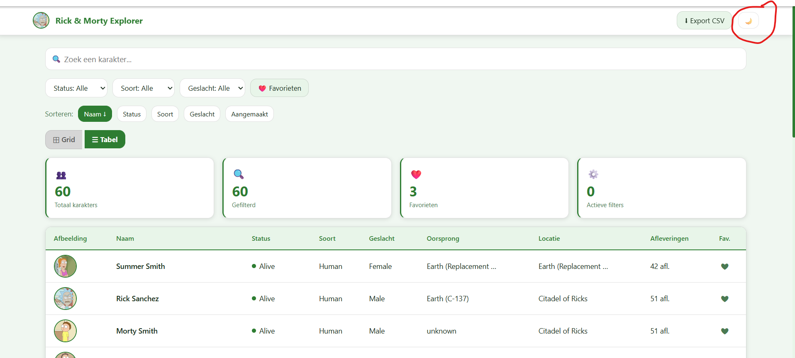
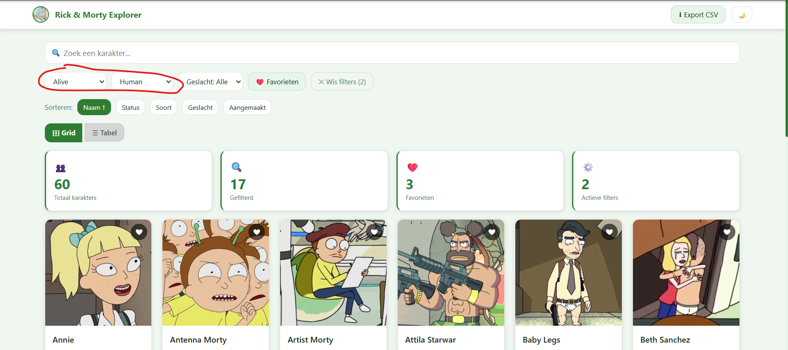

# Rick & Morty Character Explorer

Schoolproject voor het vak **Web advanced**. Een webapplicatie waarmee je karakters uit Rick and Morty kan bekijken, filteren en opslaan als favoriet.

---

## Wat doet de app?

- 60 karakters ophalen via de Rick and Morty API
- Zoeken op naam, filteren op status/soort/geslacht en sorteren
- Wisselen tussen grid- en tabelweergave
- Favorieten opslaan (blijven bewaard na herladen dankzij localStorage)
- Dark/light modus
- Favorieten exporteren als CSV

---

## Gebruikte API

**Rick and Morty API** → https://rickandmortyapi.com/

Geen API-sleutel nodig. Ik haal 3 pagina's op tegelijk met `Promise.all` zodat ik 60 karakters in één keer binnenkrijg.

---

## Hoe opstarten?

```bash
# dependencies installeren
pnpm install

# development server starten
pnpm run dev
```

Ga daarna naar `http://localhost:5173` in je browser.

---

## Structuur

```
rick-morty-explorer/
├── index.html              ← hoofdpagina
├── package.json            ← projectconfiguratie en scripts (dev/build/preview)
├── vite.config.js          ← Vite build-configuratie (output naar dist/)
├── .gitignore
├── README.md
└── src/
    ├── css/
    │   └── theme.css       ← alle stijlen en thema-variabelen
    └── js/
        ├── helpers.js      ← API, filters, render-functies, localStorage
        └── main.js         ← state, event listeners

dist/                       ← automatisch aangemaakt via pnpm run build
```
---

## Gebruikte technieken

- Fetch API + async/await + Promise.all
- DOM manipulatie via createElement en appendChild
- LocalStorage voor favorieten, thema en weergave
- IntersectionObserver voor automatisch meer laden bij scrollen
- CSS Grid en Flexbox voor de layout
- CSS custom properties voor het themasysteem

---

## Screenshots

### Dark mode — gridweergave


### Zoekfunctie met favorieten


### Tabelweergave


### Licht thema


### Filters actief (Alive + Human)


---

## Bronnen

- https://rickandmortyapi.com/documentation
- https://developer.mozilla.org/en-US/docs/Web/API/Fetch_API
- https://developer.mozilla.org/en-US/docs/Web/API/Intersection_Observer_API
- https://vitejs.dev/

### AI-gebruik
- https://chatgpt.com/g/g-p-69f64281e5c0819187d5d449a7d3ce94-web-advanced/c/6a123753-ffc8-83eb-9271-572181fdf534
---

## Auteur

|                   |                |
| ----------------- | -------------- |
| **Naam**          | Thomas Kongolo |
| **Studentnummer** | 202515030      |
| **Vak**           | Web advanced   |
